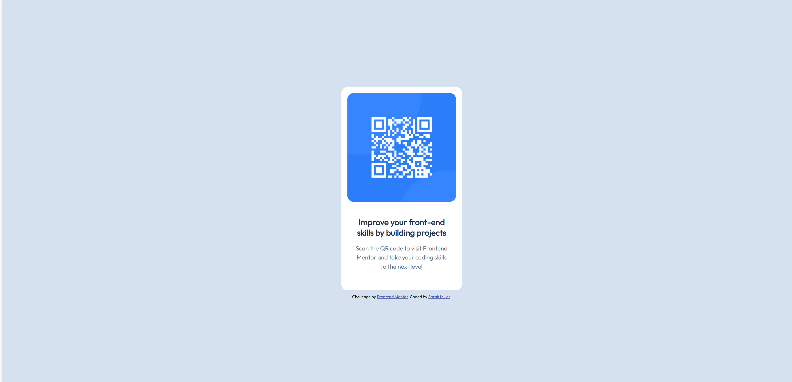

# Frontend Mentor - QR code component solution

This is a solution to the [QR code component challenge on Frontend Mentor](https://www.frontendmentor.io/challenges/qr-code-component-iux_sIO_H). Frontend Mentor challenges help you improve your coding skills by building realistic projects. 

## Table of contents

- [Overview](#overview)
  - [Screenshot](#screenshot)
  - [Links](#links)
- [My process](#my-process)
  - [Built with](#built-with)
  - [Useful resources](#useful-resources)
- [Author](#author)

## Overview

### Screenshot

### Links

- Repo URL: [github.com/hmillersarah/fm-qr-component](https://github.com/hmillersarah/fm-qr-component)
- Live Site URL: [hmillersarah.github.io/fm-qr-component/](https://hmillersarah.github.io/fm-qr-component/)

## My process

### Built with

- Semantic HTML5 markup
- CSS custom properties
- Flexbox

### Useful resources

- [Flexbox centering - Stack Overflow](https://stackoverflow.com/questions/20451293/flexbox-centering-element-in-the-middle-of-the-screen) - This forum was useful for understanding the basics behind flexbox centering and has helpful example code snippets.
- [Guide to flexbox](https://css-tricks.com/snippets/css/a-guide-to-flexbox/) - This guide provides an overview of essential flexbox knowledge.

## Author

Sarah Miller
