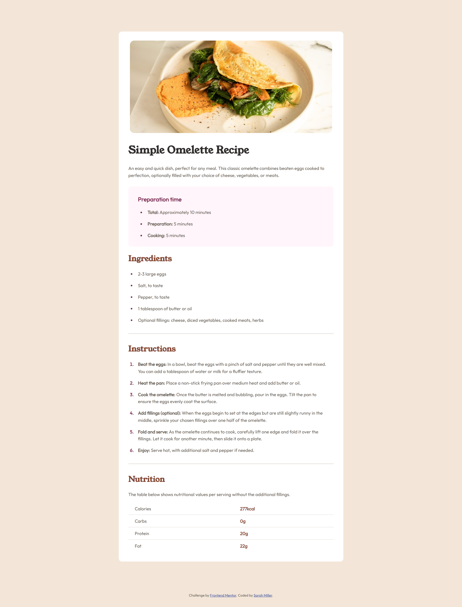

# Frontend Mentor - Recipe page solution

This is a solution to the [Recipe page challenge on Frontend Mentor](https://www.frontendmentor.io/challenges/recipe-page-KiTsR8QQKm). Frontend Mentor challenges help you improve your coding skills by building realistic projects. 

## Table of contents

- [Overview](#overview)
  - [The challenge](#the-challenge)
  - [Screenshot](#screenshot)
  - [Links](#links)
- [My process](#my-process)
  - [Built with](#built-with)
  - [Useful resources](#useful-resources)
- [Author](#author)

**Note: Delete this note and update the table of contents based on what sections you keep.**

## Overview

### Screenshot

### Links

- Solution URL: [github.com/hmillersarah/fm-recipe-page](https://github.com/hmillersarah/fm-recipe-page)
- Live Site URL: [hmillersarah.github.io/fm-recipe-page/](https://hmillersarah.github.io/fm-recipe-page/)

## My process

### Built with

- Semantic HTML5 markup
- CSS custom properties
- Flexbox
- Mobile-first workflow

### Useful resources

- [CSS Positioning](https://developer.mozilla.org/en-US/docs/Learn/CSS/CSS_layout/Positioning) - Useful resource detailing the CSS positioning options and their effects on the document flow.
- [Flexblox alignment](https://developer.mozilla.org/en-US/docs/Web/CSS/CSS_flexible_box_layout/Aligning_items_in_a_flex_container) - Helped me understand the difference between align-items and align-self

## Author

Sarah Miller

